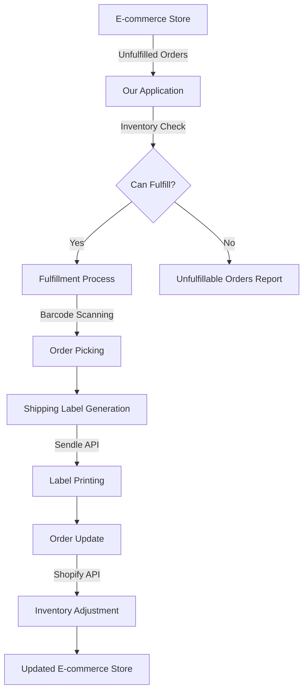
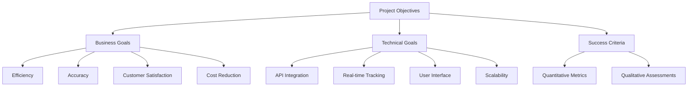
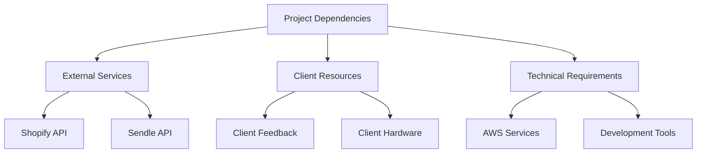
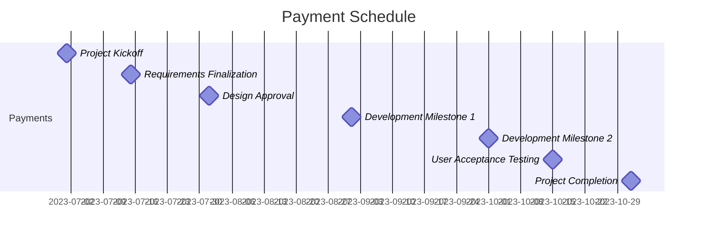
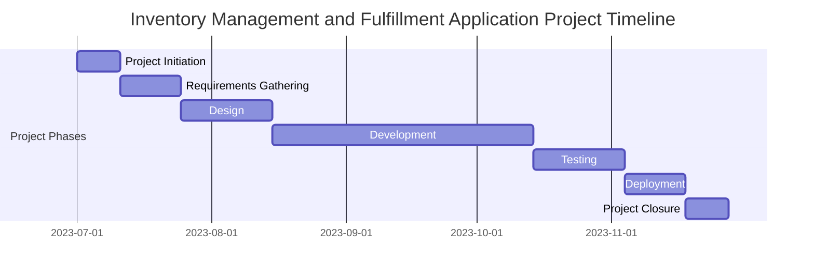
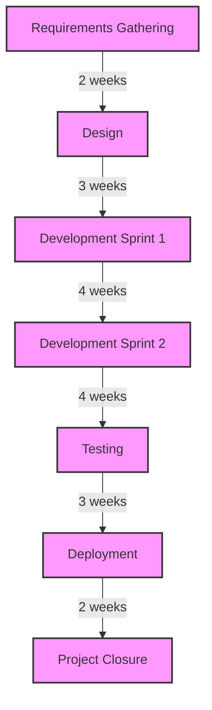
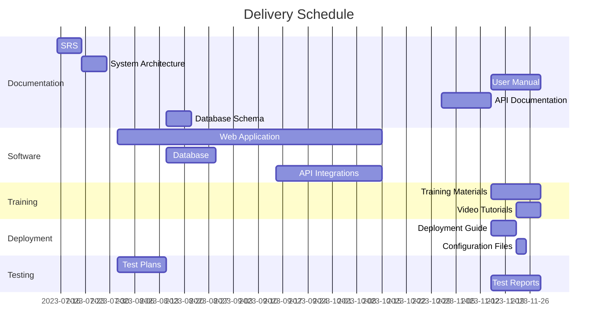

# EXECUTIVE SUMMARY

## PROJECT OVERVIEW

This project aims to develop a comprehensive web-based Inventory Management and Fulfillment Application for an e-commerce store operating on Shopify. The client faces challenges in efficiently managing inventory and streamlining the order fulfillment process, which are critical for maintaining customer satisfaction and operational efficiency. Our proposed solution addresses these pain points by providing a seamless integration between the client's Shopify store, inventory management system, and shipping processes.

The application will:
1. Automatically pull and categorize unfulfilled orders from Shopify
2. Determine order fulfillment feasibility based on real-time inventory levels
3. Facilitate a streamlined fulfillment process using barcode scanning technology
4. Generate shipping labels via Sendle API integration
5. Update Shopify orders and inventory levels in real-time

## OBJECTIVES

1. Automate order management to reduce manual errors and save time
2. Optimize inventory control to prevent stockouts and overstock situations
3. Streamline the fulfillment process to increase efficiency and reduce processing time
4. Improve accuracy in order picking and packing through barcode scanning
5. Enhance visibility into unfulfillable orders to inform restocking decisions
6. Seamlessly integrate with existing Shopify and Sendle systems
7. Provide a user-friendly interface to improve staff productivity

## VALUE PROPOSITION

Our agency offers a unique combination of expertise and tailored solutions that set us apart for this project:

1. **E-commerce Integration Specialists**: Our team has extensive experience in developing solutions that integrate seamlessly with Shopify and other e-commerce platforms.

2. **Custom-Built Solution**: Unlike off-the-shelf software, our application will be tailored to the client's specific workflow and requirements, ensuring maximum efficiency and usability.

3. **Scalable Architecture**: Our solution is designed to grow with the client's business, capable of handling increasing order volumes and inventory complexity.

4. **User-Centric Design**: We prioritize user experience, creating intuitive interfaces that require minimal training and enhance productivity.

5. **Ongoing Support and Maintenance**: We offer comprehensive post-deployment support and continuous improvement to adapt to evolving business needs.

6. **Data-Driven Insights**: Our solution will provide valuable analytics on inventory trends and fulfillment efficiency, enabling data-driven decision-making.

7. **Security Focus**: We implement robust security measures to protect sensitive customer and business data.

This comprehensive solution will significantly improve the client's operational efficiency, reduce errors, and enhance customer satisfaction through faster and more accurate order fulfillment.

## PROJECT OBJECTIVES

### BUSINESS GOALS

1. Increase operational efficiency by reducing manual order processing time by 50%
2. Improve inventory accuracy to 99.9% to minimize stockouts and overstock situations
3. Enhance customer satisfaction by reducing order fulfillment errors to less than 0.1%
4. Decrease labor costs associated with order management and fulfillment by 30%
5. Boost order processing capacity by 100% without increasing staff
6. Improve decision-making for restocking by providing clear visibility into unfulfillable orders

### TECHNICAL GOALS

1. Develop a robust web-based application that seamlessly integrates with Shopify and Sendle APIs
2. Implement real-time inventory tracking and updates across all systems
3. Create a user-friendly interface for efficient order management and fulfillment
4. Develop a secure and scalable system architecture capable of handling increasing order volumes
5. Implement barcode scanning functionality for accurate and rapid order processing
6. Establish automated data synchronization between the application, Shopify, and inventory database
7. Develop a responsive design that works efficiently on desktop browsers

### SUCCESS CRITERIA

| Criterion | Target | Measurement Method |
|-----------|--------|---------------------|
| Order Processing Time | 50% reduction | Compare average time per order before and after implementation |
| Inventory Accuracy | 99.9% | Regular inventory audits and system reconciliation |
| Order Fulfillment Errors | < 0.1% | Track customer complaints and returns related to incorrect orders |
| Labor Cost Reduction | 30% decrease | Compare labor hours and costs pre- and post-implementation |
| Order Processing Capacity | 100% increase | Measure maximum orders processed per day |
| User Adoption | 95% of staff | Track system usage and conduct user surveys |
| System Uptime | 99.9% | Monitor application availability |
| API Integration Success | 100% | Verify successful API calls and data synchronization |
| Data Accuracy | 100% | Cross-check data between Shopify, application, and inventory database |

This comprehensive set of objectives aligns the project's technical implementation with tangible business outcomes, ensuring that the Inventory Management and Fulfillment Application delivers measurable value to the e-commerce store. The success criteria provide clear, quantifiable targets that will guide the development process and allow for objective evaluation of the project's success upon completion.

# SCOPE OF WORK

## IN-SCOPE

The Inventory Management and Fulfillment Application project will include the following tasks, features, and functionalities:

1. User Authentication and Authorization
   - Secure login system
   - Role-based access control (admin, warehouse staff)

2. Dashboard
   - Summary metrics display (unfulfilled orders, fulfillable orders, inventory levels)

3. Order Management
   - Unfulfilled Orders Tab
   - Orders That Can Be Fulfilled Tab
   - Orders That Cannot Be Fulfilled Tab with export functionality

4. Order Fulfillment Process
   - Fulfillment modal with barcode scanning
   - Shipping label generation via Sendle API
   - Shopify order status update
   - Inventory adjustment

5. Inventory Management
   - Inventory intake via barcode scanning and manual entry
   - Inventory overview with filtering and searching capabilities

6. Error Handling
   - User notifications for errors
   - System logging
   - Retry mechanisms for API calls

7. API Integrations
   - Shopify API integration for order management
   - Sendle API integration for shipping label generation

8. User Interface
   - Responsive design optimized for desktop browsers
   - Intuitive layout with consistent design across all pages

9. System Architecture
   - Frontend development using modern JavaScript framework
   - Backend development with RESTful API
   - Database setup using PostgreSQL
   - Deployment on AWS EC2 instances

10. Testing
    - Unit testing for critical components
    - Integration testing

11. Documentation
    - User manuals
    - Technical documentation for maintenance

## OUT-OF-SCOPE

The following items are explicitly excluded from the project scope:

1. Mobile application development
2. Integration with e-commerce platforms other than Shopify
3. Integration with shipping providers other than Sendle
4. Custom hardware procurement (e.g., barcode scanners, label printers)
5. Physical warehouse organization or layout optimization
6. Training of client staff on warehouse management best practices
7. Development of a customer-facing order tracking system
8. Integration with accounting or financial management systems
9. Development of advanced analytics or business intelligence features
10. Multi-language support

## ASSUMPTIONS

The project plan is based on the following assumptions:

1. The client has an active Shopify store with API access
2. The client has an account with Sendle and can provide necessary API credentials
3. The client will provide timely feedback and approvals during the development process
4. The client's existing hardware (computers, barcode scanners) is compatible with web-based applications
5. The client has a stable internet connection in their warehouse/fulfillment center
6. The client will handle any necessary data migration from existing systems
7. The client will provide access to a test Shopify store for development and testing purposes
8. The project team will have access to necessary development tools and environments
9. The client will handle any staff training required to use the new system

## DEPENDENCIES

The project has the following dependencies that could impact the timeline or deliverables:

| Dependency | Description | Potential Impact |
|------------|-------------|-------------------|
| Shopify API | Availability and stability of Shopify's API | Could delay integration and testing if API changes or experiences downtime |
| Sendle API | Availability and stability of Sendle's API | Could impact shipping label generation functionality |
| Client Feedback | Timely responses and approvals from the client | May cause delays in development and implementation if not provided promptly |
| Client Hardware | Compatibility of existing barcode scanners and computers | May require additional development time for compatibility or hardware upgrades |
| AWS Services | Availability and performance of EC2 and related services | Could affect deployment and ongoing performance of the application |
| Development Tools | Access to necessary software licenses and development environments | May delay development if not readily available |

These dependencies will be closely monitored throughout the project lifecycle to mitigate risks and ensure timely delivery of the Inventory Management and Fulfillment Application.

# BUDGET AND COST ESTIMATES

## COST BREAKDOWN

The following table provides a detailed breakdown of the project costs for the Inventory Management and Fulfillment Application:

| Category | Item | Quantity | Unit Cost | Total Cost |
|----------|------|----------|-----------|------------|
| Labor | Project Manager | 240 hours | $100/hour | $24,000 |
| Labor | Senior Developer | 480 hours | $120/hour | $57,600 |
| Labor | Frontend Developer | 320 hours | $90/hour | $28,800 |
| Labor | Backend Developer | 320 hours | $100/hour | $32,000 |
| Labor | QA Specialist | 160 hours | $80/hour | $12,800 |
| Labor | UX/UI Designer | 80 hours | $90/hour | $7,200 |
| Software | Development Tools Licenses | 5 | $500/license | $2,500 |
| Infrastructure | AWS EC2 Instances (1 year) | 2 | $1,500/year | $3,000 |
| Infrastructure | AWS RDS (1 year) | 1 | $1,200/year | $1,200 |
| Miscellaneous | Third-party API Integration Costs | 1 | $2,000 | $2,000 |
| Contingency | 10% of total project cost | 1 | $17,110 | $17,110 |
| **Total** | | | | **$188,210** |

## PAYMENT SCHEDULE

We propose the following payment schedule tied to project milestones:

| Milestone | Deliverable | Payment Percentage | Amount |
|-----------|-------------|---------------------|--------|
| Project Kickoff | Signed contract and project initiation | 20% | $37,642 |
| Requirements Finalization | Approved PRD and technical specifications | 15% | $28,231.50 |
| Design Approval | Approved UI/UX designs and system architecture | 15% | $28,231.50 |
| Development Milestone 1 | Completion of core functionality (Order Management) | 20% | $37,642 |
| Development Milestone 2 | Completion of additional features (Inventory Management, API Integrations) | 15% | $28,231.50 |
| User Acceptance Testing | Successful completion of UAT | 10% | $18,821 |
| Project Completion | Final deployment and handover | 5% | $9,410.50 |

## BUDGET CONSIDERATIONS

While we have made every effort to provide an accurate and comprehensive budget, there are several areas of uncertainty or risk that could impact the final project cost:

1. **Scope Changes**: Any significant changes to the project scope after the requirements phase could lead to additional development time and costs. We will manage this through a formal change request process, where any scope changes will be evaluated for their impact on the budget and timeline.

2. **API Integration Complexities**: While we have experience with Shopify and Sendle APIs, unforeseen complexities or changes in their APIs could require additional development time. We have included a buffer in our estimates to account for this, but significant changes may impact the budget.

3. **Performance Optimization**: Depending on the volume of orders and inventory items, additional optimization work may be required to meet performance requirements. This could involve additional development time or infrastructure costs.

4. **Security Requirements**: If additional security measures are required beyond our standard practices (e.g., specific compliance requirements), this could impact both development time and infrastructure costs.

5. **Testing and Bug Fixes**: While we have allocated time for QA and testing, complex edge cases or integration issues could require additional time to resolve.

6. **Client Hardware Compatibility**: If the client's existing hardware (barcode scanners, computers) requires additional development work for compatibility, this could impact the budget.

7. **AWS Infrastructure Costs**: The costs for AWS services are estimates based on typical usage. Actual costs may vary depending on the application's usage patterns and data volume.

To manage these uncertainties:

1. We have included a 10% contingency in the budget to cover minor overruns or unexpected costs.
2. We will provide regular budget updates throughout the project and flag any potential overruns early.
3. We will work closely with the client to prioritize features if budget constraints become an issue.
4. We will conduct thorough testing early in the development process to identify any potential issues that could impact the budget.

By maintaining open communication and proactive management of these considerations, we aim to deliver the project within the proposed budget while meeting all key requirements and quality standards.

# TIMELINE AND MILESTONES

## PROJECT TIMELINE

The Inventory Management and Fulfillment Application project is estimated to take approximately 5 months from initiation to completion. The following Gantt chart outlines the major phases of the project:

## KEY MILESTONES

The following table outlines the critical milestones that mark significant progress points in the project:

| Milestone | Description | Estimated Date |
|-----------|-------------|----------------|
| M1: Project Kickoff | Project initiation and team onboarding | 2023-07-01 |
| M2: Requirements Approval | Finalization and sign-off on project requirements | 2023-07-25 |
| M3: Design Approval | Completion and approval of system architecture and UI/UX designs | 2023-08-15 |
| M4: Development Sprint 1 Completion | Core functionality (Order Management) developed | 2023-09-15 |
| M5: Development Sprint 2 Completion | Additional features (Inventory Management, API Integrations) developed | 2023-10-15 |
| M6: Testing Completion | All testing phases completed, including user acceptance testing | 2023-11-05 |
| M7: Deployment | Application deployed to production environment | 2023-11-20 |
| M8: Project Closure | Final documentation, handover, and project sign-off | 2023-11-30 |

## CRITICAL PATH

The critical path consists of tasks that directly impact the project timeline. Any delay in these tasks will result in a delay of the entire project. The following diagram illustrates the critical path:

The critical path tasks are:

1. Requirements Gathering: Ensuring all stakeholder needs are captured accurately.
2. Design: Creating a robust system architecture and intuitive UI/UX.
3. Development Sprint 1: Implementing core Order Management functionality.
4. Development Sprint 2: Implementing Inventory Management and API integrations.
5. Testing: Thorough testing of all features and integrations.
6. Deployment: Successful launch of the application in the production environment.
7. Project Closure: Final documentation and handover to the client.

To maintain the project schedule, special attention will be given to these critical path items:

- Regular progress checks and risk assessments will be conducted for each critical task.
- Resources will be allocated prioritizing critical path tasks.
- Any potential delays in these tasks will be immediately escalated and addressed.
- Parallel non-critical tasks will be managed to avoid resource conflicts with critical path items.

By closely monitoring and managing these critical path elements, we aim to ensure timely delivery of the Inventory Management and Fulfillment Application within the proposed 5-month timeline.

# DELIVERABLES

## LIST OF DELIVERABLES

The following table provides a comprehensive list of all tangible outputs for the Inventory Management and Fulfillment Application project:

| Category | Deliverable | Description |
|----------|-------------|-------------|
| Software | Web Application | Fully functional web-based Inventory Management and Fulfillment Application |
| Software | Database | Configured PostgreSQL database with necessary tables and relationships |
| Software | API Integrations | Implemented integrations with Shopify and Sendle APIs |
| Documentation | Software Requirements Specification (SRS) | Detailed document outlining all software requirements |
| Documentation | System Architecture Document | Technical document describing the system's architecture and components |
| Documentation | User Manual | Comprehensive guide for end-users on how to use the application |
| Documentation | API Documentation | Detailed documentation of all API endpoints and their usage |
| Documentation | Database Schema | Documentation of the database structure and relationships |
| Training | Training Materials | Presentation slides and hands-on exercises for user training |
| Training | Video Tutorials | Set of instructional videos covering key features of the application |
| Deployment | Deployment Guide | Step-by-step instructions for deploying the application on AWS EC2 |
| Deployment | Configuration Files | All necessary configuration files for application setup |
| Testing | Test Plans | Comprehensive test plans for unit, integration, and user acceptance testing |
| Testing | Test Reports | Detailed reports of all testing phases, including bug reports and resolutions |

## DELIVERY SCHEDULE

The following Gantt chart outlines the expected delivery schedule for each deliverable:

## ACCEPTANCE CRITERIA

The following table defines the acceptance criteria for each major deliverable:

| Deliverable | Acceptance Criteria |
|-------------|---------------------|
| Web Application | - All features specified in the SRS are implemented and functional - Application passes all unit and integration tests - User interface is responsive and meets design specifications - Application successfully integrates with Shopify and Sendle APIs - Performance meets or exceeds specified requirements (e.g., page load times) |
| Database | - Database schema matches the approved design - All necessary tables and relationships are correctly implemented - Data integrity constraints are in place and functioning - Database can handle the expected data volume without performance issues |
| API Integrations | - Successful connection and data exchange with Shopify API - Successful generation of shipping labels via Sendle API - Error handling and retry mechanisms are in place and functioning - API rate limits are respected and handled appropriately |
| Documentation | - All documents are complete, accurate, and up-to-date - Documents are clear, well-organized, and free of errors - Technical terminology is explained adequately for the intended audience - Documents are provided in the agreed-upon format (e.g., PDF, Word) |
| Training Materials | - Materials cover all key features and functions of the application - Content is clear, concise, and appropriate for the target audience - Includes practical exercises and examples - Video tutorials are of high quality with clear audio and visuals |
| Deployment Guide | - Provides clear, step-by-step instructions for deployment - Covers all necessary configuration steps - Includes troubleshooting section for common issues - Successfully tested by performing a deployment following the guide |
| Test Reports | - Comprehensive coverage of all tested features and functions - Clear description of test cases, expected results, and actual results - All critical and high-priority bugs are resolved - Includes performance test results meeting specified requirements |

Each deliverable will be reviewed against these criteria before being considered complete. The client will have a 5-business-day review period for each deliverable, during which they can request revisions or clarifications. Final acceptance of each deliverable will require written approval from the designated client representative.