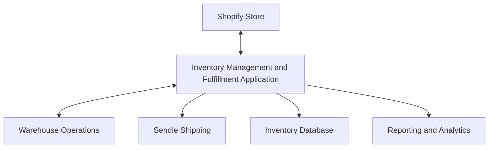
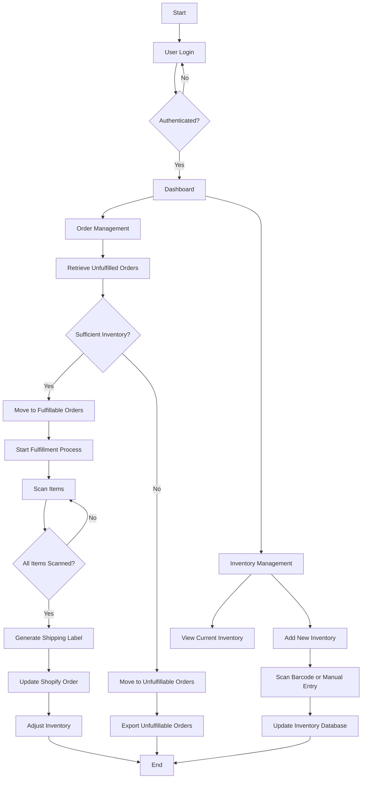
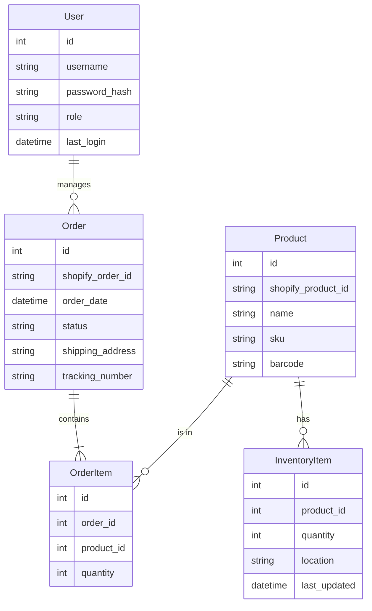
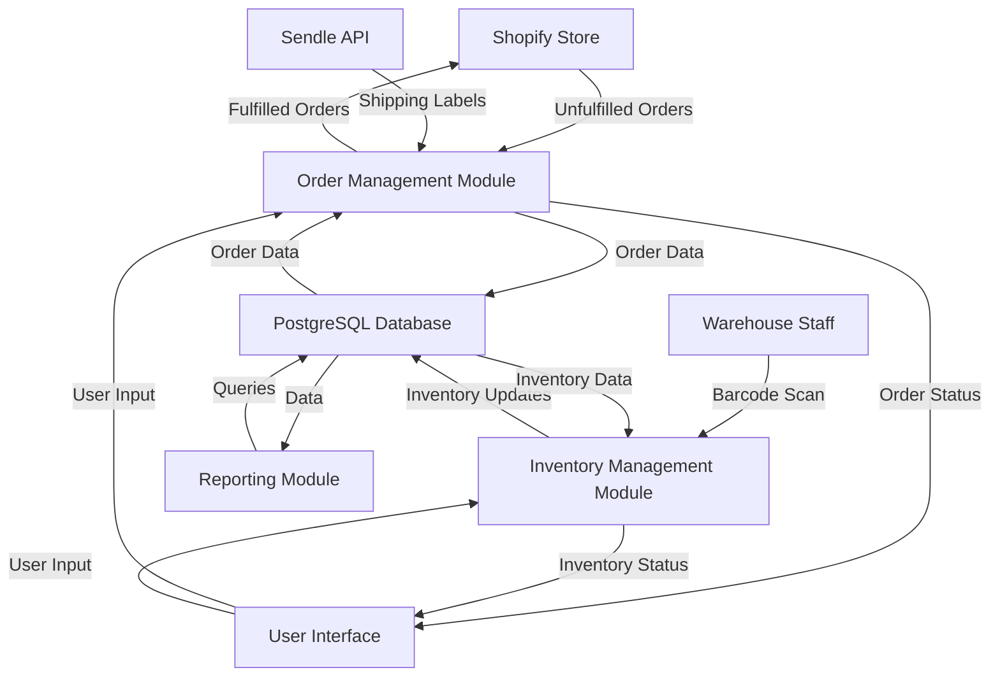

# 1. INTRODUCTION

## 1.1 PURPOSE

The purpose of this Software Requirements Specification (SRS) document is to provide a comprehensive and detailed description of the Inventory Management and Fulfillment Application for an e-commerce store operating on Shopify. This document serves as a blueprint for the development team, project stakeholders, and quality assurance personnel, outlining the functional and non-functional requirements, system architecture, and technical specifications of the application.

The intended audience for this SRS includes:

1. Development Team: To understand the required features and functionalities to be implemented.
2. Project Managers: To plan and track the project's progress based on defined requirements.
3. Quality Assurance Team: To develop test plans and ensure the application meets all specified requirements.
4. Client Stakeholders: To review and approve the proposed solution and ensure it aligns with their business needs.
5. System Administrators: To understand the deployment and maintenance requirements of the application.

This document will serve as a basis for project planning, development, testing, and acceptance criteria throughout the software development lifecycle.

## 1.2 SCOPE

The Inventory Management and Fulfillment Application is a web-based solution designed to streamline and automate the order fulfillment process for e-commerce businesses using Shopify. The application aims to bridge the gap between inventory management, order processing, and shipping label generation, providing a seamless workflow for warehouse staff and improving overall operational efficiency.

### Goals:

1. Automate the process of sorting and managing unfulfilled orders from Shopify.
2. Provide real-time inventory tracking and updates across all systems.
3. Streamline the order fulfillment process through barcode scanning and automated shipping label generation.
4. Improve inventory accuracy and reduce stockouts and overstock situations.
5. Enhance decision-making for restocking by providing clear visibility into unfulfillable orders.

### Benefits:

1. Increased operational efficiency by reducing manual order processing time.
2. Improved inventory accuracy, minimizing stockouts and overstock situations.
3. Enhanced customer satisfaction through faster and more accurate order fulfillment.
4. Reduced labor costs associated with order management and fulfillment.
5. Increased order processing capacity without the need for additional staff.
6. Better insights into inventory trends and fulfillment efficiency for data-driven decision-making.

### Core Functionalities:

1. User Authentication and Authorization: Secure login system with role-based access control.
2. Dashboard: Display of summary metrics for unfulfilled orders, fulfillable orders, and inventory levels.
3. Order Management:
   - Automatic retrieval and categorization of unfulfilled orders from Shopify.
   - Sorting of orders into fulfillable and unfulfillable based on current inventory.
   - Export functionality for unfulfillable orders to inform restocking decisions.
4. Order Fulfillment Process:
   - Barcode scanning for accurate item picking.
   - Integration with Sendle API for automated shipping label generation.
   - Real-time updates to Shopify for order status and tracking information.
5. Inventory Management:
   - Barcode scanning and manual entry for inventory intake.
   - Real-time inventory tracking and adjustments.
   - Filtering and searching capabilities for inventory items.
6. API Integrations:
   - Seamless integration with Shopify API for order management.
   - Integration with Sendle API for shipping label generation.
7. Reporting and Analytics:
   - Generation of reports on inventory levels, order fulfillment rates, and processing times.

The application will be developed using modern web technologies, including a JavaScript framework (such as React) for the frontend, a server-side language (such as Node.js) with a RESTful API for the backend, and PostgreSQL for data storage. The system will be deployed on AWS EC2 instances, ensuring scalability and reliability.

By focusing on these core functionalities and leveraging cutting-edge technologies, the Inventory Management and Fulfillment Application aims to significantly improve the operational efficiency of e-commerce businesses, enabling them to handle higher order volumes while maintaining accuracy and customer satisfaction.

# 2. PRODUCT DESCRIPTION

## 2.1 PRODUCT PERSPECTIVE

The Inventory Management and Fulfillment Application is a web-based solution designed to integrate seamlessly with an existing e-commerce ecosystem. It serves as a critical bridge between the client's Shopify store, inventory management system, and shipping processes. The application operates within the following context:

1. E-commerce Platform Integration: The application directly interfaces with the client's Shopify store, pulling unfulfilled orders and updating order statuses and inventory levels in real-time.

2. Shipping Integration: Through integration with the Sendle API, the application facilitates automated shipping label generation, streamlining the fulfillment process.

3. Inventory Management: The application serves as the central hub for inventory tracking, providing real-time updates across all connected systems.

4. Warehouse Operations: It supports and enhances existing warehouse processes, particularly in order picking and packing through barcode scanning functionality.

5. Business Intelligence: While not a full-fledged analytics platform, the application provides valuable data on order fulfillment rates, inventory levels, and processing times, supporting data-driven decision-making.



## 2.2 PRODUCT FUNCTIONS

The Inventory Management and Fulfillment Application will perform the following main functions:

1. Order Management:
   - Automatically retrieve and categorize unfulfilled orders from Shopify
   - Sort orders into fulfillable and unfulfillable based on current inventory levels
   - Provide export functionality for unfulfillable orders to inform restocking decisions

2. Order Fulfillment:
   - Facilitate order picking through barcode scanning
   - Generate shipping labels via Sendle API integration
   - Update order status and tracking information in Shopify

3. Inventory Management:
   - Track real-time inventory levels
   - Support inventory intake through barcode scanning and manual entry
   - Provide filtering and searching capabilities for inventory items

4. User Authentication and Authorization:
   - Secure login system with role-based access control

5. Reporting and Analytics:
   - Generate reports on inventory levels, order fulfillment rates, and processing times
   - Display key metrics on a user-friendly dashboard

6. API Integrations:
   - Seamless integration with Shopify API for order management
   - Integration with Sendle API for shipping label generation

## 2.3 USER CHARACTERISTICS

The application is designed for use by the following user groups:

1. Warehouse Staff:
   - Expertise Level: Low to medium technical proficiency
   - Responsibilities: Order picking, packing, and shipping
   - Key Needs: Easy-to-use interface, clear instructions for order fulfillment

2. Inventory Managers:
   - Expertise Level: Medium to high technical proficiency
   - Responsibilities: Overseeing inventory levels, managing stock
   - Key Needs: Detailed inventory reports, ability to update stock levels

3. E-commerce Managers:
   - Expertise Level: Medium to high technical proficiency
   - Responsibilities: Overseeing order fulfillment, customer satisfaction
   - Key Needs: Overview of order statuses, fulfillment rates, and inventory levels

4. System Administrators:
   - Expertise Level: High technical proficiency
   - Responsibilities: Managing user access, system maintenance
   - Key Needs: User management interface, system logs, configuration options

## 2.4 CONSTRAINTS

The development and operation of the Inventory Management and Fulfillment Application are subject to the following constraints:

1. Technical Constraints:
   - Must be compatible with modern web browsers (Chrome, Firefox, Safari, Edge)
   - Must integrate with Shopify API and adhere to its rate limits and data structures
   - Must integrate with Sendle API for shipping label generation
   - Must be deployable on AWS EC2 instances

2. Regulatory Constraints:
   - Must comply with data protection regulations (e.g., GDPR, CCPA) for handling customer information
   - Must adhere to PCI DSS standards for processing any payment-related information

3. Business Constraints:
   - Must operate within the allocated budget of $188,210
   - Must be completed within the 5-month project timeline
   - Must be scalable to handle the client's projected growth over the next 2 years

4. Operational Constraints:
   - Must be able to handle the client's current order volume with room for 100% growth
   - Must maintain system responsiveness with page load times under 2 seconds
   - Must support concurrent use by up to 50 warehouse staff members

5. Interface Constraints:
   - User interface must be intuitive and require minimal training for warehouse staff
   - Must be optimized for desktop use in a warehouse environment

## 2.5 ASSUMPTIONS AND DEPENDENCIES

The project plan and system design are based on the following assumptions and dependencies:

### Assumptions:

1. The client will provide timely access to their Shopify store and API credentials
2. The client has an active account with Sendle and can provide necessary API credentials
3. The client's existing hardware (computers, barcode scanners) is compatible with web-based applications
4. The client's warehouse has a stable and sufficiently fast internet connection
5. The client will handle any necessary data migration from existing systems
6. The client's order volume will not exceed 200% of current levels during the initial deployment phase

### Dependencies:

1. Availability and stability of the Shopify API
2. Availability and stability of the Sendle API
3. Timely feedback and approvals from the client during the development process
4. Availability of AWS EC2 instances and related services for deployment
5. Compatibility of the client's existing barcode scanners with the web application
6. Availability of necessary development tools and environments for the project team

By clearly defining these assumptions and dependencies, we can better manage project risks and ensure all stakeholders have a shared understanding of the project's context and potential challenges.

# 3. PROCESS FLOWCHART

The following flowchart illustrates the main processes of the Inventory Management and Fulfillment Application:



This flowchart outlines the primary processes within the application, including:

1. User Authentication
2. Dashboard Access
3. Order Management
   - Retrieving unfulfilled orders
   - Categorizing orders as fulfillable or unfulfillable
   - Order fulfillment process
4. Inventory Management
   - Viewing current inventory
   - Adding new inventory
5. Exporting unfulfillable orders

The flowchart demonstrates the logical flow of operations, from user login to the completion of key tasks such as order fulfillment and inventory updates. It aligns with the previously specified technology choices, including integration with Shopify for order management and the use of barcode scanning for inventory and order processing.

Here's a breakdown of the Inventory Management and Fulfillment Application into features, maintaining consistency with the previously mentioned technology and framework choices:

1. User Authentication and Authorization

ID: F001
DESCRIPTION: Secure login system with role-based access control for different user types (e.g., admin, warehouse staff).
PRIORITY: High

| Requirement ID | Requirement Description |
|----------------|--------------------------|
| F001-1 | Implement secure login functionality using industry-standard encryption |
| F001-2 | Create and manage user roles with different access levels |
| F001-3 | Implement password reset functionality |
| F001-4 | Integrate with existing authentication systems if applicable |

2. Dashboard

ID: F002
DESCRIPTION: A central dashboard displaying key metrics and summaries for quick overview of the system's status.
PRIORITY: Medium

| Requirement ID | Requirement Description |
|----------------|--------------------------|
| F002-1 | Display total number of unfulfilled orders |
| F002-2 | Show number of orders that can be fulfilled based on current inventory |
| F002-3 | Present current inventory levels for key products |
| F002-4 | Implement data visualization for key metrics |

3. Order Management

ID: F003
DESCRIPTION: Comprehensive order management system integrating with Shopify API to handle unfulfilled orders.
PRIORITY: High

| Requirement ID | Requirement Description |
|----------------|--------------------------|
| F003-1 | Automatically retrieve unfulfilled orders from Shopify |
| F003-2 | Categorize orders into fulfillable and unfulfillable based on inventory |
| F003-3 | Provide detailed view of individual orders |
| F003-4 | Implement order sorting and filtering capabilities |

4. Order Fulfillment Process

ID: F004
DESCRIPTION: Streamlined fulfillment process with barcode scanning and integration with Sendle API for shipping label generation.
PRIORITY: High

| Requirement ID | Requirement Description |
|----------------|--------------------------|
| F004-1 | Implement barcode scanning for order item verification |
| F004-2 | Integrate with Sendle API for automated shipping label generation |
| F004-3 | Update order status in Shopify upon fulfillment |
| F004-4 | Provide interface for printing shipping labels |

5. Inventory Management

ID: F005
DESCRIPTION: Real-time inventory tracking system with barcode scanning for intake and manual adjustments.
PRIORITY: High

| Requirement ID | Requirement Description |
|----------------|--------------------------|
| F005-1 | Implement barcode scanning for inventory intake |
| F005-2 | Provide manual entry option for inventory updates |
| F005-3 | Real-time inventory level updates across the system |
| F005-4 | Implement inventory search and filter functionality |

6. API Integrations

ID: F006
DESCRIPTION: Seamless integration with Shopify and Sendle APIs for order management and shipping label generation.
PRIORITY: High

| Requirement ID | Requirement Description |
|----------------|--------------------------|
| F006-1 | Implement Shopify API integration for order management |
| F006-2 | Integrate Sendle API for shipping label generation |
| F006-3 | Implement error handling and retry mechanisms for API calls |
| F006-4 | Ensure compliance with API rate limits and terms of service |

7. Reporting and Analytics

ID: F007
DESCRIPTION: Generate reports on inventory levels, order fulfillment rates, and processing times.
PRIORITY: Medium

| Requirement ID | Requirement Description |
|----------------|--------------------------|
| F007-1 | Create inventory level reports with historical data |
| F007-2 | Generate order fulfillment rate reports |
| F007-3 | Provide processing time analytics for order fulfillment |
| F007-4 | Implement export functionality for reports (e.g., CSV, PDF) |

8. User Interface

ID: F008
DESCRIPTION: Intuitive and responsive web interface optimized for desktop use in a warehouse environment.
PRIORITY: High

| Requirement ID | Requirement Description |
|----------------|--------------------------|
| F008-1 | Design and implement a user-friendly interface using React |
| F008-2 | Ensure responsiveness for various desktop screen sizes |
| F008-3 | Implement intuitive navigation between different sections |
| F008-4 | Design interface elements optimized for warehouse use (e.g., large buttons for touch screens) |

9. Error Handling and Logging

ID: F009
DESCRIPTION: Comprehensive error handling system with detailed logging for troubleshooting and system monitoring.
PRIORITY: Medium

| Requirement ID | Requirement Description |
|----------------|--------------------------|
| F009-1 | Implement detailed error logging system |
| F009-2 | Create user-friendly error messages for common issues |
| F009-3 | Develop an admin interface for viewing and managing system logs |
| F009-4 | Implement automated error notifications for critical issues |

10. Data Management and Backup

ID: F010
DESCRIPTION: Robust data management system with regular backups and data integrity checks.
PRIORITY: High

| Requirement ID | Requirement Description |
|----------------|--------------------------|
| F010-1 | Implement automated daily backups of the PostgreSQL database |
| F010-2 | Develop data integrity check routines |
| F010-3 | Create a data restoration process |
| F010-4 | Implement data archiving for historical orders and inventory data |

These features align with the previously specified technology choices, including the use of React for the frontend, a server-side language like Node.js for the backend, PostgreSQL for the database, and deployment on AWS EC2 instances. The features also incorporate the required integrations with Shopify and Sendle APIs, as well as the use of barcode scanning technology for inventory management and order fulfillment.

# 4. NON-FUNCTIONAL REQUIREMENTS

## 4.1 PERFORMANCE

| Requirement ID | Description | Target Metric |
|----------------|-------------|---------------|
| NFR-P-01 | Page Load Time | Less than 2 seconds for all pages |
| NFR-P-02 | API Response Time | Less than 500ms for 95% of API calls |
| NFR-P-03 | Order Processing Throughput | Minimum of 100 orders per minute |
| NFR-P-04 | Concurrent Users | Support up to 50 concurrent users without performance degradation |
| NFR-P-05 | Database Query Response Time | Less than 100ms for 90% of database queries |
| NFR-P-06 | CPU Utilization | Average CPU utilization below 70% under normal load |
| NFR-P-07 | Memory Usage | Application memory usage not to exceed 2GB |

## 4.2 SAFETY

| Requirement ID | Description |
|----------------|-------------|
| NFR-S-01 | Implement automatic data backups to prevent data loss in case of system failure |
| NFR-S-02 | Provide a rollback mechanism for all critical database operations |
| NFR-S-03 | Implement proper error handling to prevent system crashes and data corruption |
| NFR-S-04 | Ensure all user inputs are validated to prevent injection attacks and data integrity issues |
| NFR-S-05 | Implement a logging system to track all critical operations and errors for auditing and troubleshooting |

## 4.3 SECURITY

| Requirement ID | Description |
|----------------|-------------|
| NFR-SEC-01 | Implement secure user authentication using industry-standard encryption methods |
| NFR-SEC-02 | Enforce role-based access control (RBAC) for all system functions |
| NFR-SEC-03 | Encrypt all sensitive data at rest using AES-256 encryption |
| NFR-SEC-04 | Use HTTPS for all data transmissions to ensure data privacy and integrity |
| NFR-SEC-05 | Implement multi-factor authentication for admin access |
| NFR-SEC-06 | Conduct regular security audits and penetration testing |
| NFR-SEC-07 | Ensure compliance with OWASP Top 10 security guidelines |
| NFR-SEC-08 | Implement secure session management with automatic timeout after 30 minutes of inactivity |

## 4.4 QUALITY

### 4.4.1 Availability

| Requirement ID | Description | Target Metric |
|----------------|-------------|---------------|
| NFR-Q-A-01 | System Uptime | 99.9% uptime, excluding scheduled maintenance |
| NFR-Q-A-02 | Scheduled Maintenance Window | Maximum 4 hours per month, during off-peak hours |

### 4.4.2 Maintainability

| Requirement ID | Description |
|----------------|-------------|
| NFR-Q-M-01 | Follow industry-standard coding practices and documentation for all components |
| NFR-Q-M-02 | Implement modular architecture to facilitate easy updates and modifications |
| NFR-Q-M-03 | Provide comprehensive API documentation for all internal and external interfaces |

### 4.4.3 Usability

| Requirement ID | Description | Target Metric |
|----------------|-------------|---------------|
| NFR-Q-U-01 | User Interface Consistency | Maintain consistent design patterns across all pages |
| NFR-Q-U-02 | User Training Time | New users should be able to perform basic tasks after 2 hours of training |
| NFR-Q-U-03 | Error Message Clarity | 90% of users should understand error messages without additional explanation |

### 4.4.4 Scalability

| Requirement ID | Description |
|----------------|-------------|
| NFR-Q-S-01 | Horizontal Scalability | Support addition of new EC2 instances to handle increased load |
| NFR-Q-S-02 | Database Scalability | Support database sharding for future growth |
| NFR-Q-S-03 | API Rate Limiting | Implement configurable rate limiting for all API endpoints |

### 4.4.5 Reliability

| Requirement ID | Description | Target Metric |
|----------------|-------------|---------------|
| NFR-Q-R-01 | Mean Time Between Failures (MTBF) | Minimum 720 hours |
| NFR-Q-R-02 | Mean Time To Repair (MTTR) | Maximum 2 hours |
| NFR-Q-R-03 | Data Integrity | Zero data loss during system failures or upgrades |

## 4.5 COMPLIANCE

| Requirement ID | Description |
|----------------|-------------|
| NFR-C-01 | Ensure compliance with GDPR for handling customer data |
| NFR-C-02 | Adhere to PCI DSS standards for processing and storing payment information |
| NFR-C-03 | Comply with local data protection laws in the regions of operation |
| NFR-C-04 | Implement audit trails for all data modifications to ensure compliance with data retention policies |
| NFR-C-05 | Ensure accessibility compliance with WCAG 2.1 Level AA standards |
| NFR-C-06 | Adhere to Shopify's API terms of service and usage guidelines |
| NFR-C-07 | Comply with Sendle's API usage policies and data handling requirements |

These non-functional requirements are designed to ensure that the Inventory Management and Fulfillment Application meets high standards of performance, safety, security, quality, and compliance. They align with the previously specified technology choices, including the use of React for the frontend, Node.js for the backend, PostgreSQL for the database, and deployment on AWS EC2 instances. These requirements will guide the development process and serve as benchmarks for evaluating the system's overall quality and effectiveness.

# 5. DATA REQUIREMENTS

## 5.1 DATA MODELS

The Inventory Management and Fulfillment Application will utilize the following data models to represent the core entities and their relationships:



This entity-relationship diagram illustrates the core data structures and their relationships within the application. The model supports the key functionalities of order management, inventory tracking, and user authentication.

## 5.2 DATA STORAGE

The application will use PostgreSQL as the primary database for data storage. The following strategies will be implemented to ensure data integrity, availability, and scalability:

### 5.2.1 Data Retention

- Order data will be retained for a minimum of 7 years to comply with common business regulations.
- Inventory snapshots will be taken daily and retained for 1 year to support historical analysis.
- User activity logs will be retained for 90 days for security and auditing purposes.

### 5.2.2 Redundancy and Backup

- The PostgreSQL database will be configured with streaming replication to maintain a hot standby server.
- Daily full backups and hourly incremental backups will be performed and stored in Amazon S3.
- Backup retention policy: Daily backups will be retained for 30 days, weekly backups for 3 months, and monthly backups for 1 year.

### 5.2.3 Recovery

- A documented disaster recovery plan will be created, detailing the steps to restore the database from backups.
- Regular recovery drills will be conducted to ensure the effectiveness of the backup and recovery processes.
- The application will be designed to gracefully handle temporary database unavailability and automatically reconnect once the database is restored.

### 5.2.4 Scalability

- Database partitioning will be implemented for large tables (e.g., OrderItem, InventoryItem) to improve query performance as data grows.
- Indexes will be created on frequently queried columns to optimize read operations.
- The application will use connection pooling to efficiently manage database connections.

## 5.3 DATA PROCESSING

The application will process data through various stages, ensuring security and efficiency throughout the data lifecycle.

### 5.3.1 Data Security

- All sensitive data (e.g., user passwords) will be hashed using bcrypt before storage.
- Data in transit will be encrypted using TLS/SSL for all API communications and database connections.
- Role-based access control (RBAC) will be implemented to restrict data access based on user roles.
- Regular security audits and penetration testing will be conducted to identify and address potential vulnerabilities.

### 5.3.2 Data Flow

The following diagram illustrates the high-level data flow within the application:



This data flow diagram demonstrates how data moves between different modules of the application, external APIs, and the central PostgreSQL database. Key points in the data flow include:

1. Retrieval of unfulfilled orders from Shopify
2. Order data storage and retrieval from the PostgreSQL database
3. Inventory updates based on warehouse staff actions
4. Integration with Sendle API for shipping label generation
5. Bi-directional data flow between the application modules and the user interface
6. Data querying for reporting and analytics purposes

The application will implement appropriate error handling and logging mechanisms at each stage of the data flow to ensure data integrity and facilitate troubleshooting.

By adhering to these data requirements and implementing robust data processing workflows, the Inventory Management and Fulfillment Application will provide a secure, scalable, and efficient solution for managing orders and inventory.

# 6. EXTERNAL INTERFACES

## 6.1 USER INTERFACES

The Inventory Management and Fulfillment Application will feature a web-based user interface optimized for desktop browsers. The interface will be designed with a focus on usability and efficiency for warehouse staff and managers. Key aspects of the user interface include:

1. Responsive design for various desktop screen sizes
2. Intuitive navigation between different sections (Dashboard, Order Management, Inventory Management)
3. Clear visual hierarchy and consistent design patterns across all pages
4. Large, easily clickable buttons and elements optimized for potential touchscreen use in warehouse environments

Placeholder for mockups:

```
[Dashboard Mockup]
- Summary metrics display
- Quick access to key functions

[Order Management Mockup]
- Tabs for Unfulfilled, Fulfillable, and Unfulfillable Orders
- Order details view
- Fulfillment modal with barcode scanning interface

[Inventory Management Mockup]
- Inventory list view with filtering and search
- Inventory intake interface
- Barcode scanning interface for inventory updates
```

The user interface will be developed using React, ensuring a modern, component-based architecture that allows for efficient updates and maintenance.

## 6.2 HARDWARE INTERFACES

The application will interface with the following hardware components:

1. Barcode Scanners:
   - Connection: USB or Bluetooth
   - Compatibility: Must support common 1D and 2D barcode formats (e.g., UPC, QR Code)
   - Driver: Standard HID (Human Interface Device) driver

2. Label Printers:
   - Connection: USB or Network (Ethernet/Wi-Fi)
   - Compatibility: Must support common shipping label sizes (4x6 inches)
   - Driver: Standard printer drivers (e.g., PCL, ZPL)

The application will interact with these hardware devices through standard browser APIs and device drivers, ensuring broad compatibility with common warehouse equipment.

## 6.3 SOFTWARE INTERFACES

The Inventory Management and Fulfillment Application will interact with the following external software systems:

1. Shopify API:
   - Purpose: Retrieve unfulfilled orders, update order statuses, and sync inventory levels
   - Protocol: HTTPS
   - Data Format: JSON
   - Authentication: OAuth 2.0
   - Version: Latest stable version of Shopify API

2. Sendle API:
   - Purpose: Generate shipping labels and retrieve tracking information
   - Protocol: HTTPS
   - Data Format: JSON
   - Authentication: API Key
   - Version: Latest stable version of Sendle API

3. PostgreSQL Database:
   - Purpose: Store application data, including inventory, order information, and user data
   - Connection: Direct database connection or through an ORM (Object-Relational Mapping) layer
   - Version: PostgreSQL 13 or later

4. AWS Services:
   - EC2: For hosting the application
   - RDS: For managed PostgreSQL database (if used)
   - S3: For storing generated reports and backups

## 6.4 COMMUNICATION INTERFACES

The application will utilize the following communication interfaces:

1. HTTP/HTTPS:
   - Purpose: All client-server communication and API interactions
   - Port: 80 (HTTP), 443 (HTTPS)
   - Security: TLS 1.2 or higher for all HTTPS connections

2. WebSockets:
   - Purpose: Real-time updates for order status changes and inventory updates
   - Protocol: WSS (WebSocket Secure)
   - Library: Socket.io or similar for WebSocket implementation

3. Database Connection:
   - Protocol: PostgreSQL wire protocol
   - Port: 5432 (default PostgreSQL port)
   - Security: SSL/TLS encryption for database connections

4. Email Communication:
   - Protocol: SMTP
   - Purpose: Sending notifications and alerts to users
   - Security: STARTTLS for secure email transmission

5. Logging and Monitoring:
   - Protocol: Various (e.g., syslog, custom logging protocols)
   - Purpose: Application logging and performance monitoring
   - Integration: Compatible with common logging and monitoring tools (e.g., ELK stack, Prometheus)

All communication interfaces will be designed with security in mind, using encryption where applicable and following best practices for secure data transmission and storage.

# APPENDICES

## GLOSSARY

| Term | Definition |
|------|------------|
| Barcode Scanning | The process of using a device to read and interpret barcode information for inventory management and order fulfillment. |
| Fulfillable Orders | Orders that can be completed based on current inventory levels. |
| Inventory Intake | The process of adding new items to the inventory system. |
| SKU | Stock Keeping Unit, a unique identifier for each distinct product and its attributes. |
| Unfulfillable Orders | Orders that cannot be completed due to insufficient inventory. |

## ACRONYMS

| Acronym | Expanded Form |
|---------|---------------|
| API | Application Programming Interface |
| AWS | Amazon Web Services |
| EC2 | Elastic Compute Cloud |
| GDPR | General Data Protection Regulation |
| HTTPS | Hypertext Transfer Protocol Secure |
| JSON | JavaScript Object Notation |
| OAuth | Open Authorization |
| PCI DSS | Payment Card Industry Data Security Standard |
| RBAC | Role-Based Access Control |
| REST | Representational State Transfer |
| SRS | Software Requirements Specification |
| SSL/TLS | Secure Sockets Layer/Transport Layer Security |
| UI/UX | User Interface/User Experience |
| WCAG | Web Content Accessibility Guidelines |

## ADDITIONAL REFERENCES

1. Shopify API Documentation: https://shopify.dev/api
2. Sendle API Documentation: https://developers.sendle.com/
3. React Documentation: https://reactjs.org/docs/getting-started.html
4. Node.js Documentation: https://nodejs.org/en/docs/
5. PostgreSQL Documentation: https://www.postgresql.org/docs/
6. AWS EC2 User Guide: https://docs.aws.amazon.com/AWSEC2/latest/UserGuide/
7. OWASP Top Ten Web Application Security Risks: https://owasp.org/www-project-top-ten/
8. WCAG 2.1 Guidelines: https://www.w3.org/TR/WCAG21/

These additional references provide valuable information on the technologies and standards used in the development of the Inventory Management and Fulfillment Application. They serve as supplementary resources for developers, testers, and other stakeholders involved in the project.