# 1. INTRODUCTION

## 1.1 SYSTEM OVERVIEW

The Inventory Management and Fulfillment Application is a comprehensive web-based solution designed to streamline and automate the order fulfillment process for e-commerce businesses using Shopify. This system integrates seamlessly with Shopify's platform and Sendle's shipping services to provide a robust, end-to-end solution for inventory management, order processing, and shipment tracking.

### Key Components:

1. **Web Application**: A React-based frontend providing an intuitive user interface for warehouse staff and managers.
2. **Backend Server**: A Node.js server implementing RESTful APIs to handle business logic and data processing.
3. **Database**: PostgreSQL database for storing inventory, order, and user data.
4. **External Integrations**: APIs for Shopify (order management) and Sendle (shipping labels).
5. **Deployment**: Hosted on AWS EC2 instances for scalability and reliability.

### High-Level Architecture:

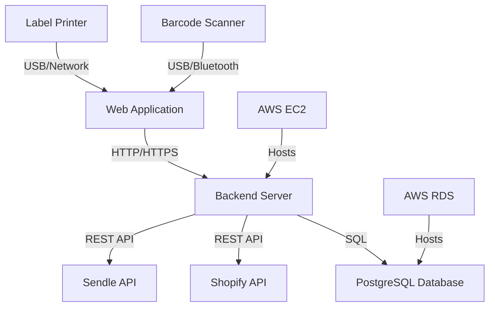

### Core Functionalities:

1. **User Authentication and Authorization**: Secure login system with role-based access control.
2. **Order Management**: Automatic retrieval and categorization of unfulfilled Shopify orders.
3. **Inventory Tracking**: Real-time inventory management with barcode scanning capabilities.
4. **Order Fulfillment**: Streamlined process for picking, packing, and shipping orders.
5. **Shipping Integration**: Automated shipping label generation through Sendle API.
6. **Reporting and Analytics**: Generation of key performance metrics and inventory reports.

### Technology Stack:

| Component | Technology |
|-----------|------------|
| Frontend | React.js |
| Backend | Node.js with Express.js |
| Database | PostgreSQL |
| API | RESTful |
| Authentication | JWT (JSON Web Tokens) |
| Hosting | AWS EC2 |
| Version Control | Git |
| Containerization | Docker |

This system is designed to significantly improve operational efficiency, reduce errors in order fulfillment, and provide real-time visibility into inventory levels and order statuses. By leveraging modern web technologies and cloud infrastructure, the application ensures scalability, reliability, and ease of maintenance.

# 5. SYSTEM ARCHITECTURE

## 5.1 PROGRAMMING LANGUAGES

The Inventory Management and Fulfillment Application will utilize the following programming languages:

| Language | Purpose | Justification |
|----------|---------|---------------|
| JavaScript (ES6+) | Frontend development (React) | Modern syntax, wide browser support, and seamless integration with React ecosystem |
| TypeScript | Backend development (Node.js) | Static typing for improved code quality and maintainability |
| SQL | Database queries and management | Standard language for relational database operations with PostgreSQL |
| HTML5 | Frontend structure | Latest standard for web content structure |
| CSS3 | Frontend styling | Modern styling capabilities, including flexbox and grid layouts |

## 5.2 HIGH-LEVEL ARCHITECTURE DIAGRAM

The following diagram provides an overview of the system's components and their interactions:

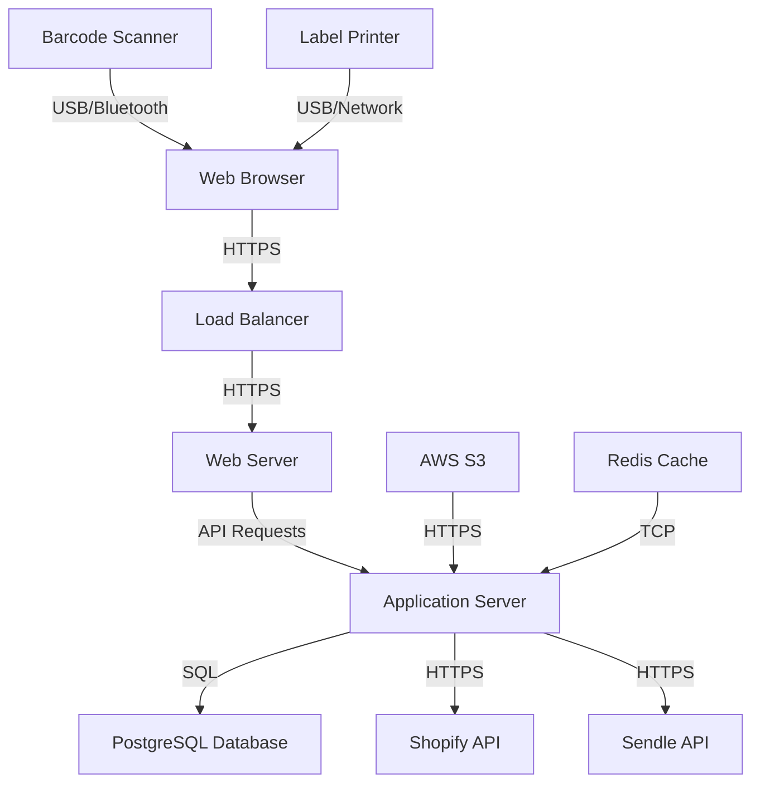

## 5.3 COMPONENT DIAGRAMS

The following diagram details the specific components within the system and their relationships:

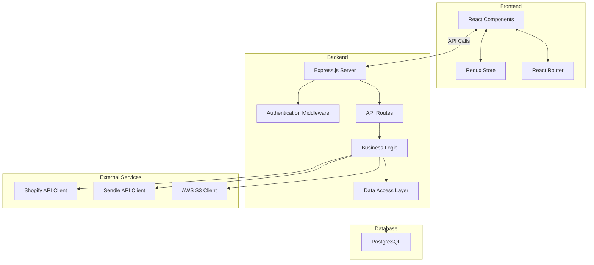

## 5.4 SEQUENCE DIAGRAMS

### 5.4.1 Order Fulfillment Process

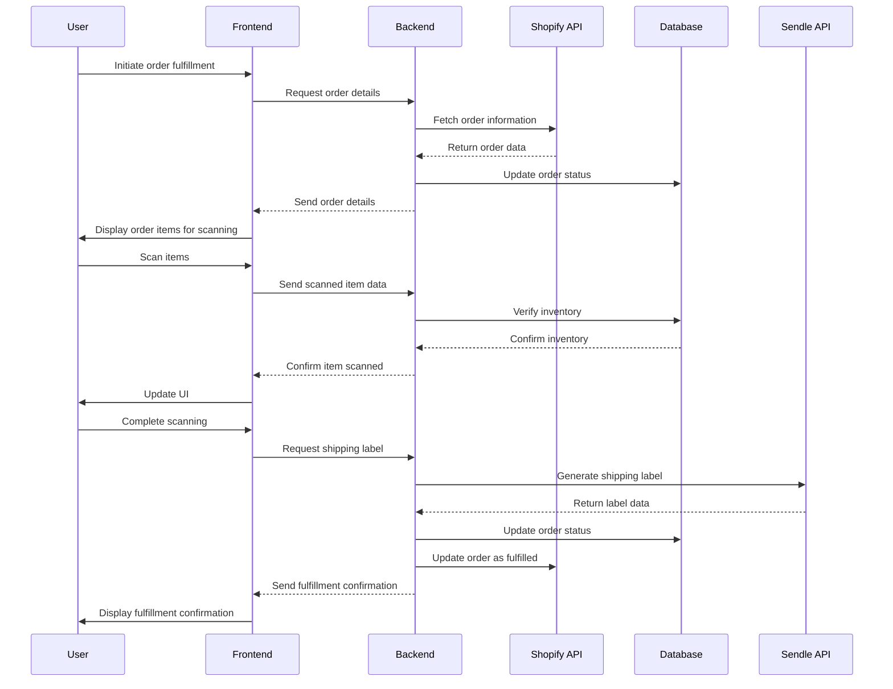

## 5.5 DATA-FLOW DIAGRAM

The following diagram explains how information moves through the system:

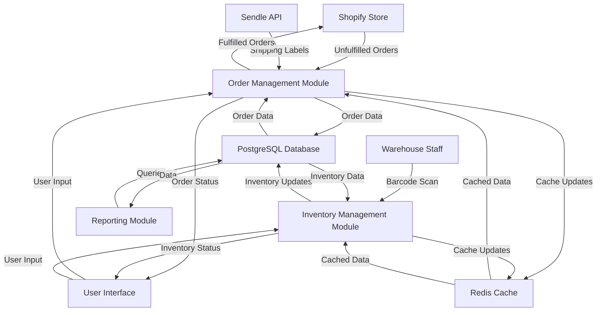

This data flow diagram illustrates:

1. The retrieval of unfulfilled orders from Shopify and their storage in the PostgreSQL database.
2. The process of inventory management, including updates from warehouse staff via barcode scanning.
3. The integration with Sendle API for shipping label generation.
4. The flow of data between different modules and the central database.
5. The use of Redis cache to improve performance for frequently accessed data.
6. The reporting module's interaction with the database for analytics and report generation.
7. The user interface's role in facilitating data input and displaying system status.

This architecture ensures efficient data processing, real-time updates, and seamless integration with external services while maintaining data consistency and system performance.

# 5. SYSTEM DESIGN

## 5.1 PROGRAMMING LANGUAGES

The Inventory Management and Fulfillment Application will utilize the following programming languages:

| Language | Purpose | Justification |
|----------|---------|---------------|
| JavaScript (ES6+) | Frontend development (React) | Modern syntax, wide browser support, and seamless integration with React ecosystem |
| TypeScript | Backend development (Node.js) | Static typing for improved code quality and maintainability |
| SQL | Database queries and management | Standard language for relational database operations with PostgreSQL |
| HTML5 | Frontend structure | Latest standard for web content structure |
| CSS3 | Frontend styling | Modern styling capabilities, including flexbox and grid layouts |

## 5.2 DATABASE DESIGN

The application will use PostgreSQL as the primary database. The database schema is designed to support the core functionalities of order management, inventory tracking, and user authentication.

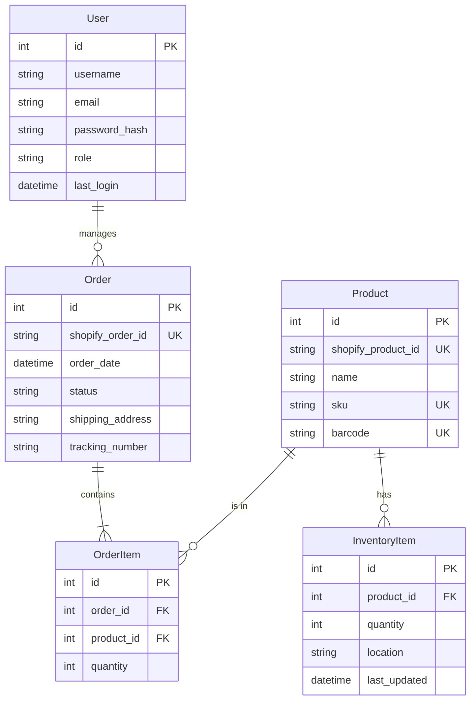

Key considerations for the database design:

1. Use of foreign keys to maintain referential integrity
2. Indexing on frequently queried columns (e.g., shopify_order_id, sku, barcode)
3. Implementation of database constraints to ensure data validity
4. Use of UUID for certain IDs to facilitate potential future data migration or integration

## 5.3 API DESIGN

The application will implement a RESTful API for communication between the frontend and backend, as well as for integration with external services (Shopify and Sendle).

### 5.3.1 Internal API Endpoints

| Endpoint | Method | Description |
|----------|--------|-------------|
| `/api/auth/login` | POST | User authentication |
| `/api/orders` | GET | Retrieve orders (with filtering options) |
| `/api/orders/:id` | GET | Retrieve specific order details |
| `/api/orders/:id/fulfill` | POST | Mark an order as fulfilled |
| `/api/inventory` | GET | Retrieve inventory items (with filtering options) |
| `/api/inventory/:id` | PUT | Update inventory item quantity |
| `/api/products` | GET | Retrieve product list |
| `/api/reports/inventory` | GET | Generate inventory report |
| `/api/reports/fulfillment` | GET | Generate fulfillment report |

### 5.3.2 External API Integrations

#### Shopify API

- Purpose: Retrieve orders and update order statuses
- Authentication: OAuth 2.0
- Key endpoints:
  - `GET /admin/api/2023-04/orders.json`: Retrieve orders
  - `POST /admin/api/2023-04/orders/{order_id}/fulfillments.json`: Create fulfillment

#### Sendle API

- Purpose: Generate shipping labels
- Authentication: API Key
- Key endpoint:
  - `POST /api/orders`: Create a new order (shipping label)

## 5.4 USER INTERFACE DESIGN

The user interface will be developed using React, focusing on a clean, intuitive design optimized for desktop use in a warehouse environment. Key components include:

### 5.4.1 Dashboard

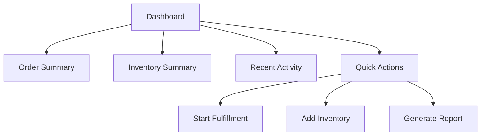

### 5.4.2 Order Management

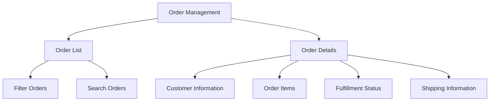

### 5.4.3 Inventory Management

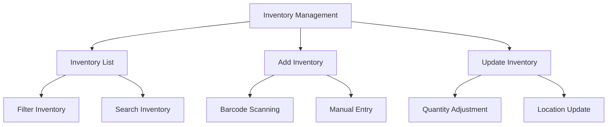

### 5.4.4 Fulfillment Process

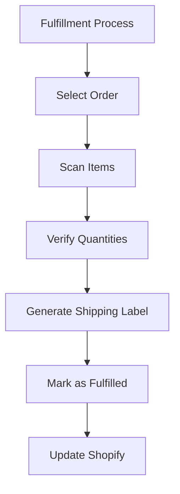

Key UI/UX considerations:

1. Responsive design for various desktop screen sizes
2. Large, touch-friendly buttons for potential use with touchscreen monitors
3. Clear visual hierarchy and consistent color scheme
4. Keyboard shortcuts for common actions to improve efficiency
5. Real-time updates for order status and inventory changes
6. Intuitive error messages and validation feedback
7. Accessibility features compliant with WCAG 2.1 Level AA standards

By implementing this system design, the Inventory Management and Fulfillment Application will provide a robust, scalable, and user-friendly solution that meets the specified requirements and integrates seamlessly with existing systems and workflows.

# 6. TECHNOLOGY STACK

## 6.1 PROGRAMMING LANGUAGES

The following programming languages will be used in the development of the Inventory Management and Fulfillment Application:

| Language | Purpose | Justification |
|----------|---------|---------------|
| JavaScript (ES6+) | Frontend development | - Widely supported by modern browsers - Rich ecosystem of libraries and frameworks - Enables dynamic and interactive user interfaces |
| TypeScript | Backend development | - Adds static typing to JavaScript, improving code quality and maintainability - Enhances developer productivity through better tooling and IDE support - Facilitates easier refactoring and code navigation |
| HTML5 | Frontend structure | - Latest standard for structuring web content - Provides semantic elements for better accessibility and SEO |
| CSS3 | Frontend styling | - Modern styling capabilities, including flexbox and grid layouts - Enables responsive design for various screen sizes |
| SQL | Database queries | - Standard language for relational database operations - Powerful querying capabilities for complex data operations |

## 6.2 FRAMEWORKS AND LIBRARIES

The following frameworks and libraries will be utilized in the development process:

### Frontend

| Framework/Library | Purpose |
|-------------------|---------|
| React | Core frontend framework for building user interfaces |
| Redux | State management for complex application states |
| React Router | Handling routing in the single-page application |
| Axios | Making HTTP requests to the backend API |
| Material-UI | UI component library for consistent and responsive design |
| Chart.js | Creating interactive charts and graphs for analytics |

### Backend

| Framework/Library | Purpose |
|-------------------|---------|
| Node.js | Runtime environment for executing JavaScript on the server |
| Express.js | Web application framework for building RESTful APIs |
| TypeORM | Object-Relational Mapping (ORM) for database interactions |
| Jest | Testing framework for unit and integration tests |
| Passport.js | Authentication middleware for Node.js |
| Winston | Logging library for application monitoring |

## 6.3 DATABASES

The application will use the following database system:

| Database | Purpose | Justification |
|----------|---------|---------------|
| PostgreSQL | Primary data storage | - Robust relational database with excellent performance - Strong support for complex queries and transactions - ACID compliance ensures data integrity - Scalable and supports large datasets |

## 6.4 THIRD-PARTY SERVICES

The following external services and APIs will be integrated into the system:

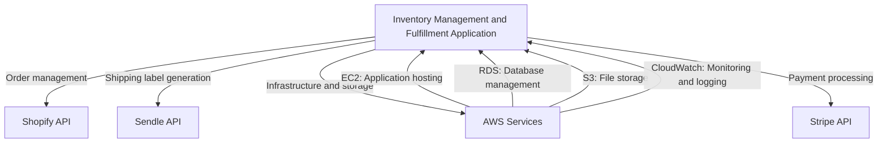

1. Shopify API
   - Purpose: Retrieve unfulfilled orders, update order statuses, and sync inventory levels
   - Integration: RESTful API calls using Axios

2. Sendle API
   - Purpose: Generate shipping labels and retrieve tracking information
   - Integration: RESTful API calls using Axios

3. AWS Services
   - EC2: Application hosting
   - RDS: Managed PostgreSQL database service
   - S3: Storage for backups and generated reports
   - CloudWatch: Monitoring and logging service

4. Stripe API
   - Purpose: Process payments for additional services or features (if applicable)
   - Integration: Stripe SDK for Node.js

This technology stack has been chosen to provide a robust, scalable, and maintainable solution for the Inventory Management and Fulfillment Application. It leverages modern web technologies and industry-standard tools to ensure efficient development and optimal performance.

# 7. SECURITY CONSIDERATIONS

## 7.1 AUTHENTICATION AND AUTHORIZATION

The Inventory Management and Fulfillment Application will implement a robust authentication and authorization system to ensure secure access and protect sensitive operations.

### 7.1.1 Authentication

| Method | Description |
|--------|-------------|
| JSON Web Tokens (JWT) | Used for stateless authentication, allowing secure transmission of user information |
| Password Hashing | Bcrypt algorithm will be used to securely hash and salt passwords before storage |
| Multi-Factor Authentication (MFA) | Optional MFA for admin accounts using Time-based One-Time Passwords (TOTP) |

Authentication Flow:

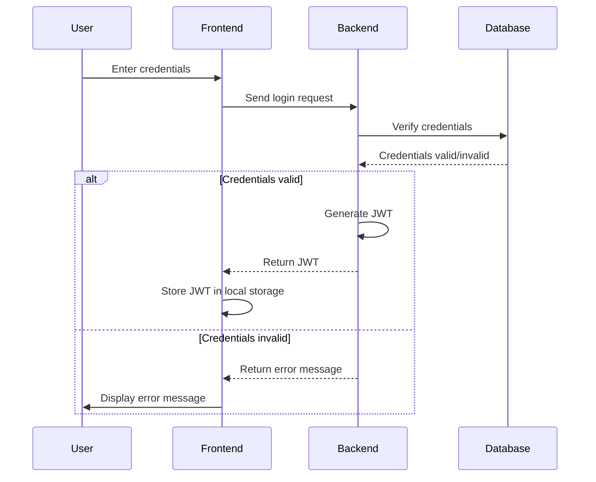

### 7.1.2 Authorization

The application will use Role-Based Access Control (RBAC) to manage user permissions.

| Role | Permissions |
|------|-------------|
| Admin | Full access to all system functions |
| Manager | Access to reporting, inventory management, and order fulfillment |
| Warehouse Staff | Access to order fulfillment and inventory scanning |

Authorization will be implemented using middleware that checks the user's role against the required permissions for each API endpoint.

## 7.2 DATA SECURITY

### 7.2.1 Data Encryption

| Data Type | Encryption Method |
|-----------|-------------------|
| Data at Rest | AES-256 encryption for sensitive data in the PostgreSQL database |
| Data in Transit | TLS 1.3 for all network communications |

### 7.2.2 Data Access Control

- Implement principle of least privilege for database access
- Use parameterized queries to prevent SQL injection attacks
- Implement data masking for sensitive information in logs and error messages

### 7.2.3 Data Backup and Recovery

- Daily encrypted backups of the PostgreSQL database stored in AWS S3
- Implement point-in-time recovery with transaction logs
- Regular testing of backup restoration process

## 7.3 SECURITY PROTOCOLS

### 7.3.1 Network Security

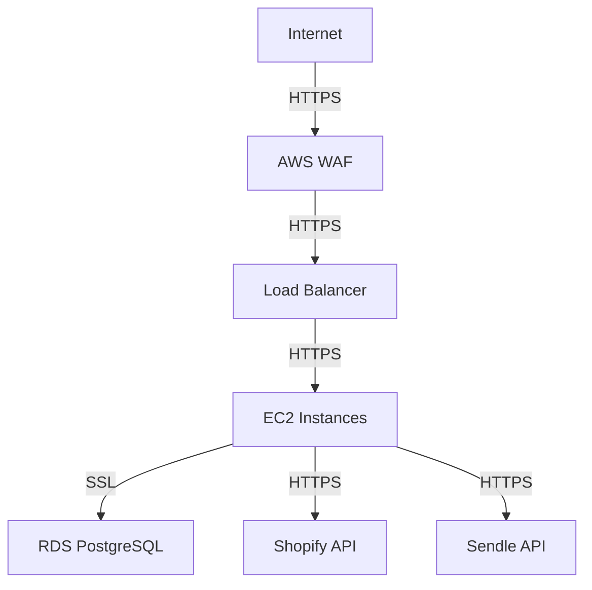

- Implement AWS Web Application Firewall (WAF) to protect against common web exploits
- Use Virtual Private Cloud (VPC) to isolate EC2 instances and RDS
- Implement network segmentation to separate web, application, and database tiers

### 7.3.2 Application Security

- Implement Content Security Policy (CSP) headers
- Use Helmet.js middleware for Express to set various HTTP headers for security
- Regular security updates and patch management for all system components

### 7.3.3 API Security

- Implement rate limiting to prevent API abuse
- Use API keys for external service authentication (e.g., Sendle API)
- Validate and sanitize all input data to prevent injection attacks

### 7.3.4 Monitoring and Incident Response

| Component | Tool/Method |
|-----------|-------------|
| Log Management | ELK Stack (Elasticsearch, Logstash, Kibana) |
| Intrusion Detection | AWS GuardDuty |
| Vulnerability Scanning | Regular scans using OWASP ZAP |

- Implement a Security Information and Event Management (SIEM) system
- Develop and maintain an Incident Response Plan
- Conduct regular security training for development and operations teams

### 7.3.5 Compliance

- Ensure GDPR compliance for handling customer data
- Implement PCI DSS controls for processing payment information
- Conduct annual security audits and penetration testing

By implementing these security considerations, the Inventory Management and Fulfillment Application will maintain a strong security posture, protecting sensitive data and ensuring the integrity of its operations. These measures align with the previously specified technology choices, including the use of React for the frontend, Node.js for the backend, PostgreSQL for the database, and deployment on AWS EC2 instances.